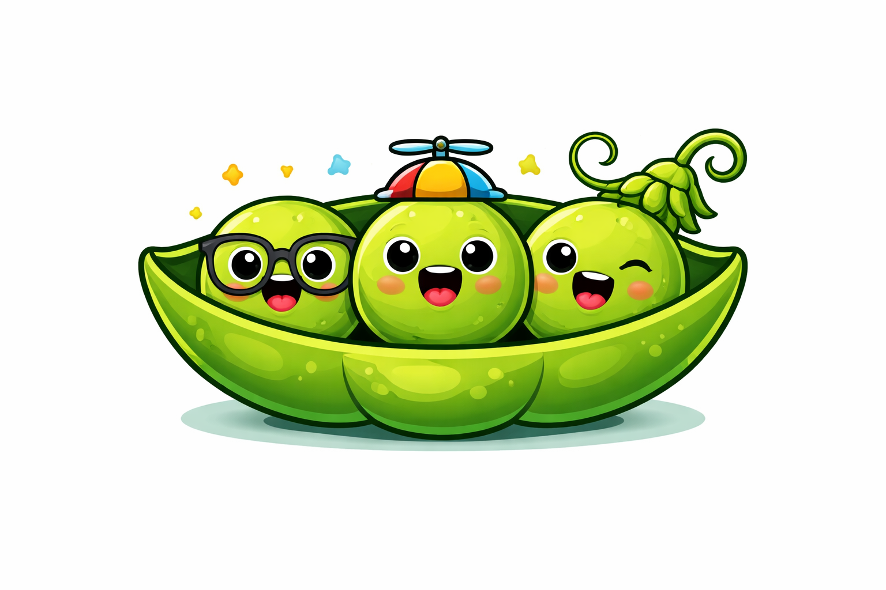

<p align="center">
  
</p>

<h1 align="center">poddies</h1>

<p align="center">
  A terminal UI for leading your pod of AI agents —<br/>
  <em>k9s for agent-team orchestration.</em>
</p>

<p align="center">
  <a href="#install">Install</a> ·
  <a href="#quickstart">Quickstart</a> ·
  <a href="#inside-the-tui">TUI</a> ·
  <a href="#chief-of-staff">Chief of Staff</a> ·
  <a href="#sessions-and-resume">Sessions</a> ·
  <a href="#architecture">Architecture</a>
</p>

---

## What it is

`poddies` lets you stand up a "pod" of AI agents — each with its own
persona, model, and effort level — and converse with them as a team
in a shared, Slack-thread-style chat. Claude Code, Gemini CLI, and
other LLM backends are spawned as subprocesses and address each other
by `@mention`. The human user is the pod lead — the CEO who kicks off
a direction, reviews output, and occasionally asks "what do you
think?" (`@sam thoughts?`).

- **Terminal-first**: run `poddies` and the interface opens. No
  subcommands, no config ceremony. Like `k9s` for `kubectl`,
  day-to-day use happens inside the TUI.
- **Backend-agnostic**: swap Claude for Gemini mid-roster by editing
  a TOML file. Same pod, different agents.
- **Session-scoped**: every launch is a clean room. `/resume` brings
  back prior conversations; stale ones auto-clean after 30 days.
- **Cost-aware**: tokens and dollars accrue in the footer so you see
  exactly what a multi-agent brainstorm costs.

## Why

Dropping into a chat with a single agent is fine, but real work is
rarely a one-voice affair. You want a backend engineer, a frontend
engineer, and maybe a PM — each staying in their lane — discussing
the task until there's a plan. `poddies` is the scaffolding for that
conversation, plus a chief-of-staff agent that steps in when requests
don't cleanly land on anyone's desk.

---

## Install

```sh
go install github.com/andrewwormald/poddies/cmd/poddies@latest
```

Add your Go bin to `PATH` if you haven't:

```sh
export PATH="$(go env GOPATH)/bin:$PATH"   # add to ~/.zshrc to persist
```

Verify:

```sh
poddies --version
poddies doctor
```

`doctor` confirms `claude` and `gemini` are on `PATH` and your root
is writable. Both adapters are optional — a missing CLI is a warning,
not an error, so you can use only the backends you have. A built-in
`mock` adapter lets you exercise the whole flow without any real LLM.

## Quickstart

```sh
poddies
```

That's it. First launch:

1. A hidden `./.poddies/` directory is scaffolded (like `.git`).
2. A default pod is created.
3. The onboarding wizard runs so you can add your first member
   (name, title, adapter, model, effort, persona — via numbered
   choices or free text).
4. You land in the chat view. Type a message, hit Enter, the pod
   runs.

Each subsequent launch creates a **new session** — a blank canvas —
so unrelated conversations don't contaminate each other or pad out
agent context. Type `/resume` to pick up where you left off on a
prior one.

## What the TUI looks like

```
┌── poddies · demo ── session: 2026-04-19-143023 ── alice, bob ── lead: alice ──┐
│                                                                              │
│ [human] investigate the login bug                                            │
│ [alice] @bob can you pull the repro while I read the auth code?              │
│ [bob] found it — token refresh drops the csrf claim                          │
│ [alice] patching the handler now, @bob can you write a regression test?      │
│ [bob] done. ship it                                                          │
│ [sam]  milestone: patch + test landed in 4 turns                             │
│                                                                              │
├──────────────────────────────────────────────────────────────────────────────┤
│ > _                                                                          │
│ stopped: quiescent (turns=5)   5 turns · 4,812 tokens · $0.0147              │
└──────────────────────────────────────────────────────────────────────────────┘
```

## Inside the TUI

### Views (command palette)

Press `:` to open the palette, then type a view name:

| command   | view                                          |
|-----------|-----------------------------------------------|
| `:thread` | the chat conversation (default)               |
| `:members`| roster of pod members                         |
| `:pods`   | all pods under the root                       |
| `:threads`| named threads under the current pod           |
| `:perms`  | pending permission requests                   |
| `:doctor` | adapter + root health check                   |
| `:help`   | keybindings + command reference               |
| `:quit`   | exit                                          |

### Global keys

| key        | action                                       |
|------------|----------------------------------------------|
| `:`        | open palette                                 |
| `?`        | open help                                    |
| `Esc`      | back to `:thread` (or cancel a wizard)       |
| `Ctrl-C`   | exit (cancels any in-flight loop)            |

### Slash commands (in the chat view)

| command                | action                                          |
|------------------------|-------------------------------------------------|
| `/add`                 | wizard to add a new member                      |
| `/remove`              | pick a member and remove                        |
| `/edit`                | edit a member's field (title/adapter/model/…)   |
| `/export`              | dump the pod as a portable TOML bundle          |
| `/resume`              | list recent sessions                            |
| `/resume <id>`         | re-open a prior session (prefix matches)        |
| `/new`                 | quit and start a fresh session                  |
| `/help`, `/quit`       | ...as you'd expect                              |

### Permissions

When a loop halts with pending permission requests, a yellow pane
appears above the input with keybindings:

- `a` approve the oldest pending request
- `d` deny the oldest
- `A` / `D` approve / deny all pending at once

## Configure a pod

Pods live under `.poddies/pods/<name>/`. Each member is a TOML file:

```toml
# .poddies/pods/demo/members/alice.toml
name    = "alice"
title   = "Staff Engineer"
adapter = "claude"        # claude | gemini | mock
model   = "claude-opus-4-7"
effort  = "high"          # low | medium | high
persona = "Pragmatic, terse. Pushes back on over-engineering."
skills  = ["go", "auth", "distributed-systems"]
```

Pod-level settings in `pod.toml`:

```toml
name = "demo"
lead = "alice"            # "human" for a human-led pod

[chief_of_staff]
enabled  = true
name     = "sam"
adapter  = "claude"
model    = "claude-haiku-4-5"
triggers = ["milestone", "unresolved_routing", "gray_area"]
```

## Chief of Staff

Each pod can enable a built-in facilitator agent — think exec's
chief-of-staff. It's addressable via `@<name>` and fires automatically
on three kinds of triggers:

- **`milestone`** — every N member turns (default 3), posts a concise
  summary of what just happened.
- **`unresolved_routing`** — when nobody's been `@mentioned` and the
  lead is human, gives the CoS one shot to propose a next speaker.
- **`gray_area`** — when the human posts a message with no `@mention`,
  the CoS either routes it to a member who clearly owns the domain,
  or answers it directly. If the human did `@mention` someone, the
  trigger steps aside — your explicit intent wins.

The CoS defaults to a cheap, fast model because it runs often.

## Sessions and `/resume`

Every launch creates a fresh session — a clean conversation, its own
thread log, its own agent-side session IDs. This avoids the noise
trap where a shared long-lived thread accumulates off-topic chatter
that every future turn pays to re-process.

Session IDs are `YYYY-MM-DD-HHMMSS-<hex>` — sortable and readable.
They live at `.poddies/sessions/<id>/thread.jsonl` and are indexed in
`.poddies/sessions.toml`.

```
/resume                # list recent sessions in the transcript
/resume 2026-04-19     # prefix match — re-opens the matching session
/new                   # drop this session, start a fresh one
```

Stale sessions (no edits in 30 days) get cleaned up asynchronously on
each launch. Window is configurable per root.

## Cost awareness

The footer shows cumulative turns, tokens, and dollars for the
current session. Each adapter invocation reports usage; Claude
includes cache-hit counts too (so you see the benefit of prompt
caching on repeated prefixes). Real-time burn rate means you catch an
agent going on a rant before your budget does.

```
3 turns · 2,847 tokens (in 2,120 / out 727) · $0.0089
```

## Scripting surface (hidden)

Everything the TUI drives is available as subcommands for automation.
Hidden from `--help` by default; reveal with:

```sh
poddies --help-scripting
```

Common uses:

```sh
poddies pod export demo --out bundle.toml
poddies pod import bundle.toml --as team-beta --overwrite

poddies member add --pod demo --name alice --title "Staff" \
  --adapter claude --model claude-opus-4-7 --effort high
poddies member edit --pod demo --name alice --effort medium

poddies thread show --pod demo default
poddies thread approve default <request-id>

poddies run --pod demo --message "@alice ship it"
```

These are useful in CI pipelines and scripted bootstraps. The TUI
remains the intended day-to-day surface.

## Architecture

```
┌──────────────────┐        ┌──────────────────┐
│       TUI        │◄───────│   Orchestrator   │
│   (bubbletea)    │        │                  │
│                  │        │   Route ─ pure   │
│  ┌────────────┐  │        │   Loop  ─ turns  │
│  │ Palette    │  │        │   CoS   ─ hooks  │
│  │ Wizards    │  │        └────────┬─────────┘
│  │ Permissions│  │                 │
│  │ Views      │  │        ┌────────▼─────────┐
│  └────────────┘  │        │     Adapter      │
└──────────────────┘        │                  │
                            │  ┌──────────┐    │
┌──────────────────┐        │  │  claude  │───►┐
│     Session      │◄───────│  │  gemini  │    │
│                  │        │  │   mock   │    │
│  sessions.toml   │        │  └──────────┘    │
│  sessions/<id>/  │        └──────────────────┘
│    thread.jsonl  │                 │
│    .meta.toml    │                 ▼
└──────────────────┘          subprocess CLI
                              (claude / gemini)
```

- **`internal/config`** — `pod.toml`, member TOMLs, bundle format,
  strict-mode decoding, slug validation.
- **`internal/thread`** — append-only JSONL log with forward-compatible
  unknown event types, `@mention` parsing, permission helpers,
  per-thread `meta.toml` for session IDs + token counters.
- **`internal/adapter`** — one `Invoke(ctx, req)` per turn; backends
  render the thread into their own prompt format. `claude` (one-shot
  + streaming), `gemini`, `mock` (demos + tests). Shared subprocess
  plumbing lives in `internal/adapter/cliproc`.
- **`internal/orchestrator`** — pure `Route` next-speaker policy,
  `Loop` with milestone + unresolved-routing + gray-area triggers,
  rescue budget for the facilitator.
- **`internal/session`** — per-launch session model, cleanup, legacy
  root migration.
- **`internal/tui`** — bubbletea app, command palette, wizard
  abstraction, multi-view renderer, streaming event subscription.
- **`internal/cli`** — cobra wiring; scripting commands hidden from
  `--help` by default, revealable with `--help-scripting`.

## Testing

Every exported function has direct unit tests. Golden-file tests
cover config round-trip, JSONL log format, renderer output, and full
end-to-end scenarios (init → pod → members → run → permissions →
resume). 13 packages, race-enabled suite:

```sh
go test ./... -race -count=1
```

Roadmap: see [FEATURES.md](./FEATURES.md).

## License

MIT — see [LICENSE](./LICENSE).
